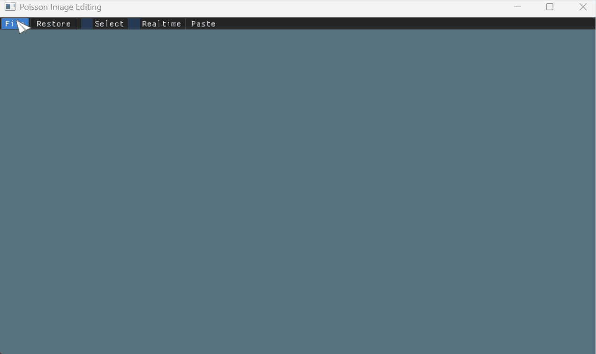
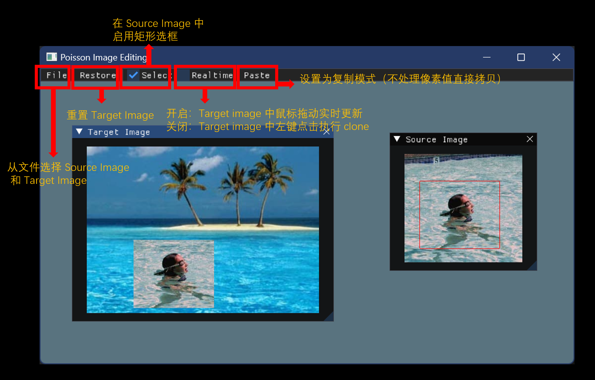
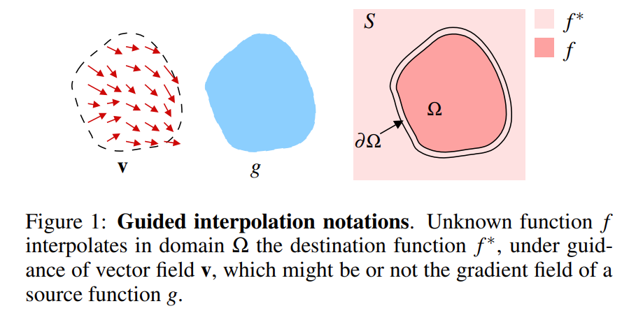
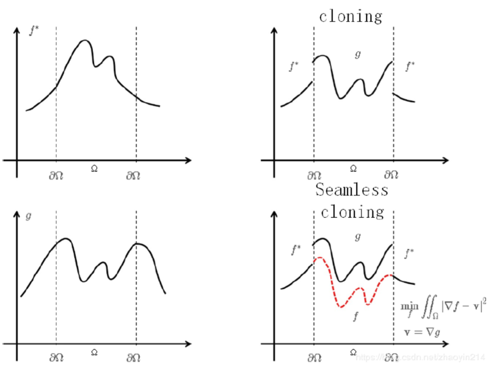
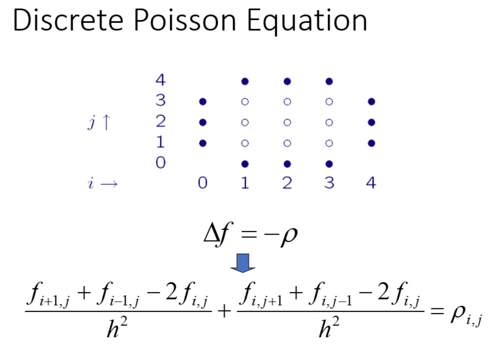
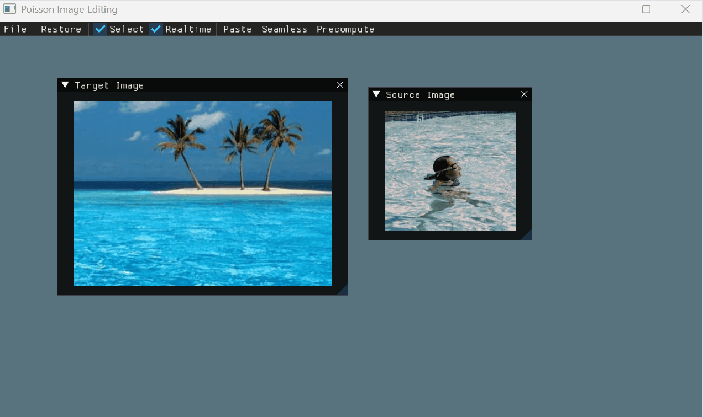
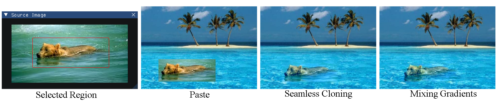
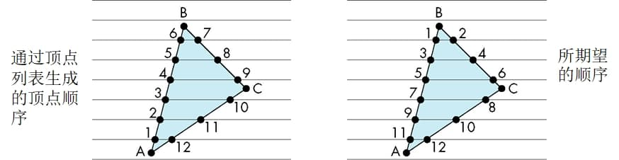
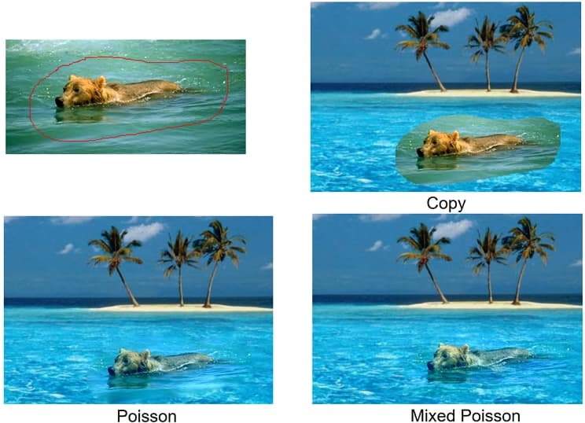
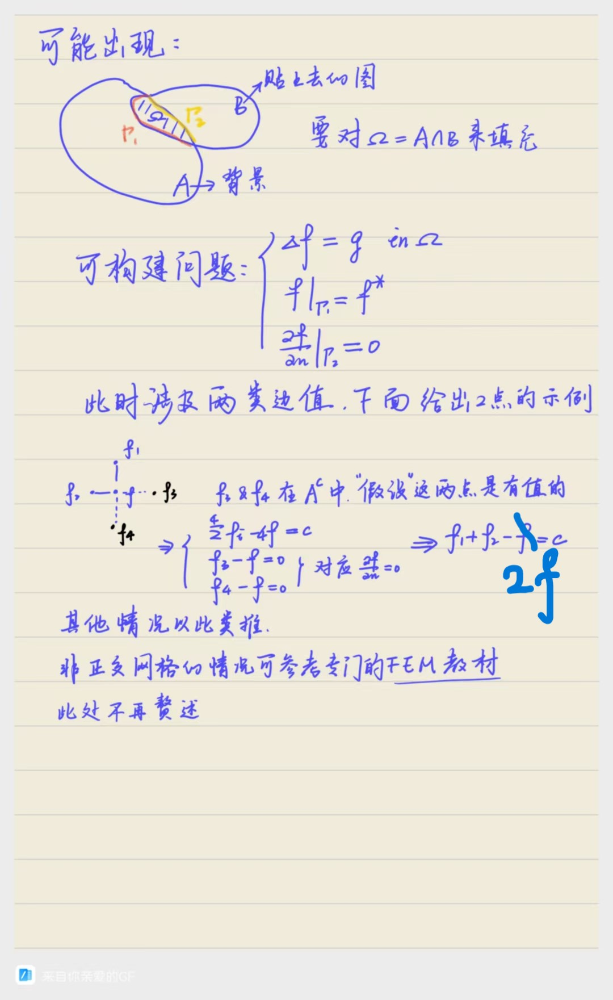

# Poisson Image Editing 说明文档

## 学习过程

- 你需要使用到 [Eigen](../../2_image_warping/documents/eigen_example/) 库，如何配置这个库可以参考上一个作业的说明文档；
- 主要修改 [target_image_widget.cpp](../../../Framework2D/src/assignments/3_PoissonImageEditing/target_image_widget.h) 中的 `clone()` 函数，实现 Poisson 图像融合的算法。我们已经提供了源图像 (Source Image) 矩形区域的选取功能，以及将该区域简单 `paste` 到目标图像 (Target Image) 中的实现示例。我们在待实现位置处标明了 `HW3_TODO`。本文档接下来的教程将辅助同学们阅读论文 [Poisson Image Editing [SIGGRAPH 2003]](https://www.cs.jhu.edu/~misha/Fall07/Papers/Perez03.pdf) [^03Perez]，以及实现图像无缝融合的算法。

## 提示

- 善用 VS Code 的全局搜索功能，快捷键 `Ctrl+Shift+F`，例如你可以使用这个功能全局搜索 `HW3_TODO` 的提示，帮助快速定位到关键部分。
- 测试实时效果时，一定要使用 **Release 模式** 运行程序，能够 **显著提升程序的运行速度**（vscode 中，可以 Ctrl+Shift+P 输入 CMake: Select Variant，选择 Release）（此时无法使用 Debug 工具）
- **注意整型和浮点型的转换**，图像操作的行列下标是整型，但是在一些操作中，只有转化为浮点型运算才能保证计算的精度。
- **符合项目要求的结构设计、实现方法有很多，你不一定要严格按照下面的提示来实现，如果你有更好的想法，请务必实现它，并且在报告文件中详细描述。**

## 目标和要求

- 利用框架中提供的矩形区域选取功能，实现**矩形区域的 Poisson 图像融合**（列出并求解关于像素颜色的稀疏线性方程组），至少须实现论文中 Seamless Cloning 的 Importing gradients 部分；
  - 仿照前面的作业，自己创建相应功能的文件和类（不推荐在 [target_image_widget.cpp](../../../Framework2D/src/assignments/3_PoissonImageEditing/target_image_widget.h) 中直接实现）
- 学习使用 Eigen 库的**矩阵预分解**，选择**适合的**矩阵分解方法，实现鼠标拖动的**实时编辑**（打开 UI 中的 Realtime 开关）；
- **保底要求**完成后，再考虑扩展**选做**内容：
  - （optional）更多的区域：例如多边形区域的选取功能（扫描线算法）和Poisson 方程求解
  - （optional）其他梯度条件：例如混合梯度

## 0. 交互和框架说明

如果运行成功，可以看到如下的界面：

<div align=center></div align>

基本功能：

<div align=center></div align>

和上一个作业一样，作为图像编程的入门，我们封装了一个简易的图像类 [`Image`](../../../Framework2D/include/common/image.h)，一些可能会用到的图像操作有

```c++
int width(); // 获取宽度
int height(); // 获取高度
int channels(); // 获取通道数，例如 RGB 格式的图像是 3 通道，RGBA 格式的图像是 4 通道

// 获取 (x,y) 位置的像素值，是一个 0~255 值构成的，长度为通道数的数组
std::vector<unsigned char> get_pixel(int x, int y); 

// 设置 (x,y) 位置的像素值，需要输入一个符合通道长度的数组作为这个像素的颜色
// 经过特殊处理，4 通道的 RGBA 图像也可以输入长度为 3 的 RGB 数据 
void set_pixel(int x, int y, const std::vector<unsigned char>& values);
```

框架提供导入两张图片的功能：
- 导入 Source Image 创建源图像的窗口，它作为 Poisson Image Editing 中被移动的区域来源，实现在 [source_image_widget.h](../../../Framework2D/src/assignments/3_PoissonImageEditing/source_image_widget.h)。
- 导入 Target Image 创建目标图像的窗口，它作为 Poisson Image Editing 的背景板，实现在 [target_image_widget.h](../../../Framework2D/src/assignments/3_PoissonImageEditing/target_image_widget.h)。
  
你可以参考 [target_image_widget.h](../../../Framework2D/src/assignments/3_PoissonImageEditing/target_image_widget.h) 中 `clone()` 函数 `Paste` 功能的实现对相关的接口有一个大致的了解。

## 1. 图像融合的问题建模（论文 Section.2 的 Guided Interpolation）

图像融合算法 [^03Perez]（把图像看作 $\mathbb{R}^2 \rightarrow \mathbb{R}^3$ 的映射）求解的是这样一个问题：

**Input:** 背景/目标图像 $f^*$，源图像 $g$，背景图像中的待修改区域 $\Omega$；
  
**Output:** 新图像 $f$，**插值**图像 $f^ *$ 在 $\Omega$ 以外的部分，满足 $f| _ {\partial \Omega} = f ^ *| _ {\partial \Omega}$.

<div align=center></div align>

如何确定 $\Omega$ 区域以内的部分？可选的方式有很多。

- `Paste` 功能直接把 $g$ 在 $\Omega$ 的值替换过来，但显然这样不算“无缝融合”；
- 论文中的 Equation.(3) 给出了另一种方式，用一个向量场 $\boldsymbol{v}$ 来引导区域内部颜色的变化，如果取这个向量场为源图像的梯度场 $\nabla g$，就可以做到插值出来的区域具有源图像的选中区域的细节。

<div align=center></div align>

 Equation.(3) 是一个变分问题，可以转化为求解区域 $\Omega$ 上 Dirichlet 边界条件的 Poisson 方程（Equation.(4)）。

>[!NOTE]
> 我们**只需要关心上述 Poisson 方程离散化的的数值求解方法**（Equation.(7)）（以及取 $\boldsymbol{v} = \nabla g$ 时的 Equation.(11)），这是一个有关 $\Omega$ 内部区域所有像素点值的**大型稀疏线性方程组**（其实是三个，因为每个像素点有三个通道 RGB）。
>
> <div align=center></div align>

## 2. 算法的代码实现

### 2.0 如何获得算法的输入

可以参考 `clone()` 函数 `Paste` 功能的实现了解相关的接口和属性。
- 背景/目标图像 $f^*$，存储在 `TargetImageWidget::data_` 中；
- 源图像 $g$，存储在 `SourceImageWidget::data_` 中，可以在 `clone()` 函数中用 `source_image_->get_data()` 获得；
- 背景图像中的待修改区域 $\Omega$，这个区域由用户在源图像中选择决定，在框架中，我们用如下方式给出
  - `SourceImageWidget::selected_region_mask_` 存储了一张与源图像一样尺寸的黑白图像，用 `source_image_->get_region_mask()` 获取，它的每一个像素只可能有两个值（0 or 255），标记为 255 的像素表示选中的区域；
  - `source_image_->get_position()` 记录了在源图像中，选定区域的相对位置（例如矩形的左上角）；
  - `TargetImageWidget::mouse_position_` 记录了在目标图像中，用户用鼠标选定的位置；
  - 通过上述两个位置，就可以确定背景图像中的要修改的区域 $\Omega$。我们认为 $g$ 也定义在这个区域上（有一个坐标的偏移量）。

```cpp
// 矩形区域的复制操作
std::shared_ptr<Image> mask = source_image_->get_region_mask(); // 选中区域
for (int x = 0; x < mask->width(); ++x) {
    for (int y = 0; y < mask->height(); ++y) {
        // 选中区域在源图像中的位置
        auto selected_region_position = source_image_->get_position(); 
        // 选中区域到目标图像中要做的偏移量
        int offset_x = static_cast<int>(mouse_position_.x) 
          - static_cast<int>(selected_region_position.x);
        int offset_y = static_cast<int>(mouse_position_.y) 
          - static_cast<int>(selected_region_position.y);
        // 选中区域的 (x, y) 到目标图像中对应的位置
        int tar_x = x + offset_x;
        int tar_y = y + offset_y;
        // 复制被标记为非 0 的选中区域
        if (0 <= tar_x && tar_x < image_width_ && 0 <= tar_y &&
            tar_y < image_height_ && mask->get_pixel(x, y)[0] > 0) {
            // 从源图像中取颜色
            auto source_image_data = source_image_->get_data();
            data_->set_pixel(tar_x, tar_y, source_image_data->get_pixel(x, y));
        }
    }
}
```

可以参考以下图示帮助理解：
<div align=center></div align>


### 2.1 从矩形区域开始
矩形区域的好处是内部像素的获取容易，可以直接用行、列的循环遍历，且处理 Poisson 方程的边界条件时比较规则。因此，我们先用矩形的区域实现 Poisson 图像融合算法，并用这个算法实现论文中的 seamless cloning 应用，我们已经为这个算法预留了一个名为 `kSeamless` 的 `CloneType`，你可以补充 `clone()` 函数中这个枚举值对应的部分。

```cpp
switch (clone_type_) {
    case USTC_CG::TargetImageWidget::kPaste: {
        ...
        break;
    }
    case USTC_CG::TargetImageWidget::kSeamless: {
        // HW3_TODO: You should implement your own seamless cloning. For
        // each pixel in the selected region, calculate the final RGB color
        // by solving Poisson Equations.
        break;
    }
    default: break;
}
```

>[!NOTE]
>**注意：** 这次作业我们没有为图像融合算法的实现提供额外的文件，因此，你需要：
>  - 进行抽象和封装，为图像融合算法的实现设计合理的类，暴露合理的接口供 `TargetImageWidget` 等类调用
>  - 在作业文件夹下为这个类创建相应的`*.h`, `*.cpp`文件
>    - 注意添加好了之后要重新 CMake Configure 以将其包含进项目中
  
### 2.2 算法类的设计
一种方式是（你可以自由发挥）构建如下的 `SeamlessClone` 类，它接受背景图像 $f^*$、源图像 $g$、选中区域（黑白图像）$\Omega$ 作为输入，调用 `solve()` 得到一个新图像 $f$：

```cpp
class SeamlessClone
{
   public:
    ...
    std::shared_ptr<Image> solve(); // 给外部调用的接口，求解 Poisson 方程组，返回一个 Seamless Clone 的结果图像（和背景图像一样大，替换了选中区域）
    ...

   private:
    // 注意使用指针，避免额外的复制操作
    std::shared_ptr<Image> src_img_; // 源图像
    std::shared_ptr<Image> tar_img_; // 背景图像
    std::shared_ptr<Image> src_selected_mask_; // 选中区域（矩形情形可以无视）
    int offset_x_, offset_y_;        // 矩形区域在背景图像中的位置（例如，左上角的坐标）
    ...
};
```

然后，直接在 [3_PoissonImageEditing/](../../../Framework2D/src/assignments/3_PoissonImageEditing/) 下为它添加 `seamless_clone.h` 和相应的实现 `seamless_clone.cpp`。

### 2.3 稀疏方程的构造
论文中的 Equation.(7) 提供了要求解的线性方程组，我们用 Eigen 库来处理它。方程组可以写成 $\boldsymbol{A}\boldsymbol{r} = \boldsymbol{B}$ 的格式。假设求解的区域 $\Omega$（内部）是一个 $W \times H$ 的矩形，其 $W \times H$ 个像素的颜色就是待求解的变量。不妨只考虑 r 通道，我们将它们“拉长”为一个 $W\times H$ 维向量 $\boldsymbol{r}$。对于矩形，它的边界检查很容易，我们可以根据 Equation.(7) 填写系数矩阵 $\boldsymbol{A}$ 和 $\boldsymbol{B}$ 的元素。

例如，对于编号为 `y*W+x` 的 $(x, y)$ 像素，我们可以列出第 `y*W+x` 个方程：（$g$ 表示源图像，实际取值的时候需要转换一下坐标）

- 如果它是一般的内部点：
  ```
  4*r[y*W+x] - r[(y-1)*W+x] - r[(y+1)*W+x] - r[y*W+x-1] - r[y*W+x+1]
      = 4*g(x, y) - g(x, y-1) - g(x, y+1) - g(x-1, y) - g(x+1, y)
  ```
- 如果这个像素和边界点相邻（很好判断），例如，`x==0` 而 `0<y<H`，表示这个像素在左边界：
  ```
  4*r[y*W+x] - r[(y-1)*W+x] - r[(y+1)*W+x] - r[y*W+x+1]
      = 4*g(x, y) - g(x, y-1) - g(x, y+1) - g(x-1, y) - g(x+1, y) + f*(x-1+o_x, y+o_y)
  ```
可以看出，每一个方程只有很少（最多5个）系数，所以系数矩阵 $\boldsymbol{A}$ 是高度稀疏的，这种方程在 Eigen 库中可以特殊处理，和稠密矩阵不同，一般我们用一个三元组的 vector 来初始化：

```cpp
#include <Eigen/Sparse>

Eigen::SparseMatrix<double> A(W * H, W * H);
Eigen::VectorXd B(W * H);

std::vector<Eigen::Triplet<double>> triplet_list; // 使用三元组 vector 来存储非零元素
```

然后逐步往三元组列表中添加非零元的位置和值，例如一般的内部点：
```cpp
// 填写 (x, y) 对应的方程系数
int idx = y * W + x;
triplet_list.push_back(Eigen::Triplet<double>(idx, idx, 4.0));
triplet_list.push_back(Eigen::Triplet<double>(idx, (y - 1) * W + x, -1.0));
triplet_list.push_back(Eigen::Triplet<double>(idx, (y + 1) * W + x, -1.0));
triplet_list.push_back(Eigen::Triplet<double>(idx, y * W + (x - 1), -1.0));
triplet_list.push_back(Eigen::Triplet<double>(idx, y * W + (x + 1), -1.0));
// 填写 B 的系数（g 表示源图像，需自己用检索函数取值）
B(idx) = 4.0 * g(x, y) - g(x, y - 1) - g(x, y + 1) - g(x - 1, y) - g(x + 1, y);
```

在添加好所有的方程系数之后，从三元组构建稀疏方程，就得到了系数矩阵

```cpp
A.setFromTriplets(triplet_list.begin(), triplet_list.end());
```

>[!Note]
> **注意**：实现中，有许多边界条件需要处理！

>[!Tip]
> 有同学敲完代码之后运行发现不对劲，~~天都塌了~~，包括但不限于：编译报错，运行崩溃，结果抽象。但其实这些情况是正常现象，建议：
> - 检查输出，明确出错位置和原因，矩阵维数和向量维数不匹配这些问题都有可能出现；
> - 不要直接上大图像测试，小图像、纯色图像（梯度为 0）等等例子也是很有帮助的；
> - 多调试多输出，比如看看小区域上的矩阵列的对不对，检查矩阵的对称性等等；
> - 单独排查每一个部分，比如分别检查矩阵和右侧向量的正确性；
> - ~~想到了再补充~~

### 2.4 稀疏方程组的求解
构造好 `A` 和 `B` 后，调用 Eigen 的稀疏方程组求解器即可。然而，选择哪一种求解器亦有讲究，Eigen 中提供 LU 分解、QR 分解、LLT/LDLT 分解，共轭梯度法 ConjugateGradient 等等多种求解器，各有不同的适用场景。


以 `Eigen::SimplicialLDLT` 为例，求解稀疏方程组可以如下操作：

```cpp
Eigen::SimplicialLDLT<Eigen::SparseMatrix<double>> solver; // 创建 SimplicialLDLT 求解器
solver.compute(A); // 分解矩阵 A
Eigen::VectorXd r = solver.solve(B); // 求解方程组 Ar = B
```

这样就得到了红色通道的所有颜色值，其他通道的颜色也可以类似计算（或者直接合并成 3 列的矩阵，一次性求解）。

>[!Note]
> 对特定的问题使用适应的矩阵分解方法会极大的提高求解效率，提升求解稳定性。
> 
> **仔细思考：** 使用**一种**稀疏方程组求解方法（LU，QR，cholesky，……）求解线性方程组。有些方法不适用该问题，可能效率很低，也可能求解失败。请选择一种适合的方法。

>[!Note]
> 解得的结果一定可以作为像素值来使用吗？如果出现负数，或者超出了像素值允许的范围，会发生什么情况？

### 2.5 稀疏矩阵的预分解
如果勾选 UI 上的 Realtime，可以在鼠标拖动的时候更新融合结果。但是有可能因为效率问题达不到实时，这是因为在每一帧都需要对一个大型稀疏方程进行求解。注意到，在拖动过程中，系数矩阵 `A` 总是保持不变的，我们只要分解一次就够了。因此，我们可以使用矩阵的**预分解**技术，实现**实时**的 Poisson Image Editing：

对于线性方程组 $AX=b_i$ ，对于相同的 $A$ ，不同的 $b_i$ ，如果每次都重新整体求解方程组，耗时太严重。常用的做法是对 $A$ 进行预分解，这样对于不同的 $b_i$ ，只需要花费很少的时间，就可以得到解。

Eigen 库中，稀疏求解器（例如 `SparseLU`）中的函数 `compute()` 就是对矩阵进行预分解。

>[!Note]
> 也请确保最终结果是在 Release 模式下运行，Debug 模式下运行也会对计算效率产生较大影响！

实时效果可以参考（你可以添加自己喜欢的交互方式）

<div align=center></div align>

至此，矩形区域的图像融合、实时编辑就完成了（下图的 Seamless Cloning 的结果）。

<div align=center></div align>


## 3. 实现混合梯度（Optional）
我们前面取向量场 $\boldsymbol{v}$ 为源图像的梯度信息。如果换成论文中 Equation.(12) 的形式，就是混合梯度方法。和前面实现的方法唯一的不同就是右边系数 $\boldsymbol{B}$ 有所不同。可以自行尝试（见上图的 Mixing Gradients 的结果）。

## 4. 实现复杂形状区域的 Poisson 融合（Optional）

> 有人问，矩形区域的效果确实还行，但交互上还是太局限了，有没有什么选取复杂区域的接口可以提供一下嘛？有的同学，有的。像这样可以围出封闭区域的形状还有很多，我们在作业一 MiniDraw 中就实现了好几种。

### 4.1 区域选取（扫描线算法实现）
对于形状的选取功能主要在 `SourceImageWidget` 类中实现，在形状的设计和绘制方面，你可以仿照或者修改复用作业 1 的代码，目前只有矩形的情况。

唯一需要新增的是，对于每一个绘制的形状，都应该提供一个 `get_interior_pixels()` 函数（在 `SourceImageWidget::update_selected_region()`中调用）。这个函数返回该形状所有的内部像素坐标，根据这些坐标，我们可以更新选中的区域 `SourceImageWidget::selected_region_mask_`，从而提供给外部函数使用。

对于多边形（Freehand 也是类似的），要想获取其区域中的像素点，可以学习实现**多边形的扫描线算法**。

> #### 多边形的扫描线算法
>
> 多边形的扫描线算法是多边形区域光栅化（求解一个平面多边形区域的内部像素）的经典算法，可在任何一本计算机图形学的课本上都能找到，网上也有不少详细介绍资料。算法的基本思想是：通过维持一个特别的数据结构（结构中保存扫描线与多边形的交点）进行填充。
> <div align=center></div align>
>
>

### 4.2 不规则 Poisson 方程的构造和求解
获取了复杂区域的像素之后，第二个任务就是根据这个区域列出离散的 Poisson 方程（Equation. (7)），从而求出所有的内部点对应的像素值。这一步需要注意边界点的检测和处理。

边界点的像素值是已知的，但是也可以当作未知数放在方程中求解，只需要把系数矩阵在这一行的对角元设置为 1，其他位置设置为 0，右边取这个边界点的像素值即可。也就是 **把边界点和内部点联合起来列一个方程**。


## 测试图片

### 测试图像

须用 [**测试图像**](../data/) 来进行测试；鼓励使用其他图像来测试各种应用效果（比如生成个性化的表情包），呈现在你的报告中。

### 结果示例

<div align=center></div align>

## 资源介绍

- 进一步规范代码实现规范和习惯，继续阅读并提高 C++ 编程的技巧和经验
  - 提高 C++ 编程的 50 项技巧（[百度网盘](http://pan.baidu.com/s/1gdECTBd)）
  - 改进 C++ 程序的 6 个技巧（[百度网盘](http://pan.baidu.com/s/1ntNojhf)）
  - [Google 命名规则](https://google.github.io/styleguide/cppguide.html) 
- 如何查找文献（[百度网盘](http://pan.baidu.com/s/1o6z56T8)）
- [数学在计算机图形学中的应用](http://staff.ustc.edu.cn/~lgliu/Resources/CG/Math_for_CG_Turk_CN.htm) 


## 自由边界的特殊处理方法
在贴图的时候，可能存在**贴图范围超出了背景图像**的矩形框。这个时候贴图和背景的交集**存在部分边界没有固定像素值**。
下面给出一种解决方法。该方法仅作为演示如何求解混合边值问题，具体实现上效率不高（需要根据相交区域重新计算矩阵）。大家可以尝试去探寻**更高效**的做法。此处仅作为抛砖引玉😋。
更严谨的推导详见各大FEM教材
<div align=center></div align>

## 参考文献

[^03Perez]: Pérez P, Gangnet M, Blake A. [**Poisson image editing**](https://www.cs.jhu.edu/~misha/Fall07/Papers/Perez03.pdf), ACM Transactions on Graphics (Proc. SIGGRAPH), 22(3): 313-318, 2003. 