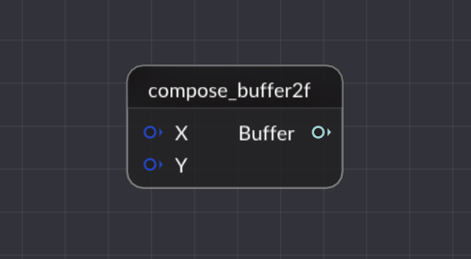

# 基本节点介绍

## 1. 文件的读入与输出

网格文件的读入有许多方式，以这次的作业为例，我们使用read_usd来读入一个网格，其基本节点如下所示：

File Name内填的是文件的路径，内部可以填绝对路径，也可以填相对路径（我们推荐使用相对路径，相对路径是相对于可执行程序的路径）

Prim Path内部填写的是文件的基本路径，比如要打开Balls.usda，则以文本打开这个文件，会显示如下信息：

内部Xform以及Mesh所显示的提示我们填入/Balls/Balls，注意这里用的是“/”而不是“\”，我们要导入其他.usda文件也可以这么导入，第三个则暂时不用管。

输出则是geometry类型，至于怎么使用这个类型，可以参考所给的例子[半边结构的操作示例](https://github.com/USTC-CG-NEXT/Framework3D/blob/419eb8ccc75532ced3713402f733493eaa5a94fb/source/Editor/geometry_nodes/node_curvature.cpp)

将mesh之类的显示出来则需要使用write_usd，其基本节点如下所示：

其输入的数据类型是geometry类型，作用可以理解为将其在上面的渲染器中显示出来。

## 2. 网格的组成与分解

如果想取出网格中的特定元素，我们则可以使用下面这个节点：

mesh_decompose节点，其输入一个网格，输出则是其点以及一些内部的属性，其数据类型则分别对应的是Mesh：Geometry，FaceVertexCounts：pxr::VtArray<int>，FaceVertexIndices：pxr::VtArray<int>，Normals：pxr::VtVec3fArray，Texcoords：pxr::VtArray<pxr::GfVec2f>。这里提一嘴，如果不知道输入和输出的数据类型是什么，可以善用搜索功能找到这个文件来看看add_input和output里面写的是什么类型。

同样的，如果我们想要组成一个mesh网格，我们可以使用这个节点：

这个节点相当于上一个节点的反向使用，使用如图所示的一些数据来组成一个网络，数据结构跟上面是一样的。

ps：如果接口的颜色不同，说明了数据结构是不同的，连接不同的数据结构是无法操作的！！！

## 3. buffer的使用

在这个节点图中，还有一组重要的节点需要介绍，那就是buffer。buffer节点允许你对数据进行更自由的编辑，以以下节点为例：

输入的x，y将其组装成一个buffer，本质上是输入三个pxr::VtArray<float>数据类型，将其转化成pxr::VtArray<pxr::GfVec2f>这个数据类型，但看可能没有什么大作用，但是配合其他的buffer操作就有了一些意义。

以上两个buffer操作配合使用，可以将一个三维向量取出其x，y坐标重新组装成一个二维向量，这就是最简单的一个例子。

## 4. 纹理的操作

贴一个纹理，我们需要网格顶点的参数坐标，而如下图则是设置一个网格的纹理坐标的节点：

输入一个网格，再输入一个顶点的参数化坐标（注意，参数化坐标是一个二维向量）得到一个带有参数化坐标的网格。虽然mesh_compose也有Texcoords这项输入，不过我们把这个单独拎出来可能更容易理解一点。

以下节点则是设置纹理的操作：

输入一个网格（带有参数化坐标），以及一个纹理文件，输出一个带有纹理贴图的网格。这里输入的Texture Name则与read_usd相同，可以使用绝对路径，也可以使用相对路径，同样推荐使用相对路径。

有了这些认识回头再去看看所给出的示例节点图，说不定会有一些新的认识。