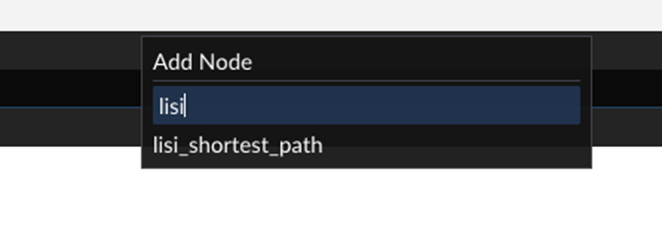

# 4. 曲面参数化 Tutte Parameterzation

## 作业步骤：
> 作业步骤：
> - 阅读[文档](documents/README.md)，内含多个小教程
> - 在[项目目录](../../Framework3D/)中编写作业代码
> - 按照[作业规范](../README.md)提交作业

## 作业递交

- 递交内容：程序代码、实验报告及 `stage.usdc` 文件，见[提交文件格式](#提交文件格式)
- 递交时间：2025年3月23日（周日）晚

## 要求

- 实现论文 [Floater1997](https://www.cs.jhu.edu/~misha/Fall09/Floater97.pdf) 中介绍的 Tutte 网格参数化方法，主要原理见[作业课件](https://rec.ustc.edu.cn/share/1c0d1d10-db2e-11ef-b910-f95ea2c8844c)
  - 边界固定，构建并求解稀疏方程组得到**极小曲面**
  - 边界映射到平面凸多边形，求解稀疏方程组得到**曲面参数化**
- 尝试多种（2~3种）权重设置
  - Uniform weights
  - Cotangent weights
  - Floater weights (Shape-preserving)（Optional）
- 使用测试纹理和网格检验实验结果


## 目的

- 熟悉网格数据结构，了解基本操作方法（访问邻域、访问边界）（参考示例）
- 了解纹理映射，对参数化结果进行可视化
- 了解节点编程思想
- 巩固使用大型稀疏线性方程组的求解


## 提供的材料

依照上述要求和方法，根据说明文档`(1) documents`和作业框架`(2) Framework3D`的内容进行练习。

### (1) 说明文档 `documents` [->](documents/) 

本次作业的要求说明和一些辅助资料

### (2) 作业项目 `Framework3D` [->](../../Framework3D/) 

作业的基础代码框架

## 提交文件格式

<!-- 请确保按照如下顺序完成作业（**务必仔细**阅读图文操作流程 [F3D_kickstart.pdf](../../Framework3D/F3D%20kickstart.pdf)）：

- 首先，在 [submission/](../../Framework3D/submissions/) 文件夹下**复制**一份 [assignments/](../../Framework3D/submissions/assignments/) 文件夹，并改名为 `lisi_homework/`（依你的姓名而定）；
- 确保**在上一步操作完成之后**，再实现和连接你的节点图。这样，你自己实现的所有节点在框架界面中都应该**自动**包含了你的名称前缀（这对我们很重要！）。例如李四同学实现的所有节点都应该自动包含如下的 `lisi_` 前缀：
- <div align=center></div align> -->
完成作业之后，打包三样内容即可：
  - 你的 `xxx_homework/`文件夹（拷贝并改名自 [assignments/](../../Framework3D/submissions/assignments/)，不要包含中文，详见 [F3D_kickstart.pdf](../../Framework3D/F3D%20kickstart.pdf)）
  - 节点连接信息（stage.usdc，来自框架目录下的 `Assets/` 文件夹，请一并拷贝到上边的 `xxx_homework/`文件夹里）；
  - 报告（命名为 `id_name_report4.pdf`）
  
  具体请务必严格按照如下的格式提交：

  ```
  ID_姓名_homework*/                // 你提交的压缩包
  ├── xxx_homework/                  
  │  ├── stage.usdc                    // （额外添加）本次作业的节点连接信息
  │  ├── data/                         // 测试模型和纹理
  │  │   ├── xxx.usda
  │  │   ├── yyy.usda
  │  │   ├── zzz.png
  │  │   └── ...  
  │  ├── utils/                        // 辅助代码文件
  │  │   ├── some_algorithm.h
  │  │   ├── some_algorithm.cpp
  │  │   └── ...  
  │  └── nodes/                        // 本次作业你实现or修改的节点文件
  │      ├── node_your_implementation.cpp
  │      ├── node_your_other_implementation.cpp
  │      └── ...  
  ├── id_name_report4.pdf                    // 实验报告
  ├── CMakeLists.txt                // CMakeLists.txt 文件不要删除
  └── ...                           // 其他补充文件
  ```

### 注意事项

- 导入数据（网格和纹理）时使用**相对路径**，例如，将你的数据放在可执行文件目录下，直接通过 `FilePath = 'xxx.usda'` 或者 `FilePath = 'zzz.png'` 访问，或者定位到作业目录的 `data/` 文件夹中；
- 在 `node_your_implementation.cpp` 等文件中使用
  ```cpp
  #include "some_algorithm.h"
  ```
  包含你的辅助代码；其中some_algorithm.h & some_algorithm.cpp直接放在utils中。
- 如果除了添加 `utils/` 和 `node_your_implementation.cpp`，你还**对框架有其他修改**，就**打包上传所有代码**。
- **尽量不要动框架的东西！！！！**