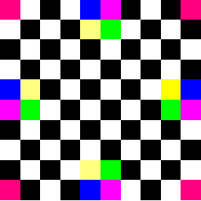
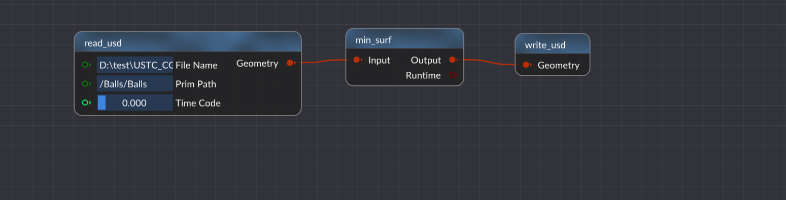
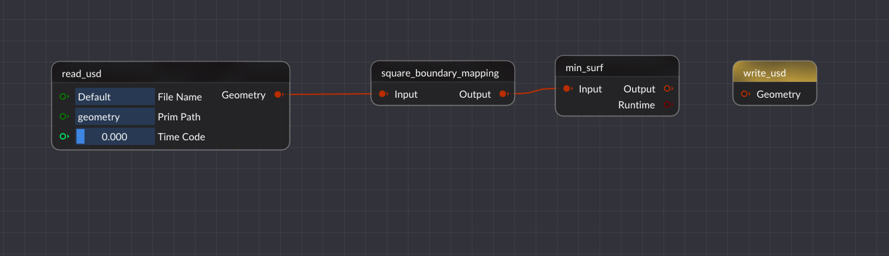
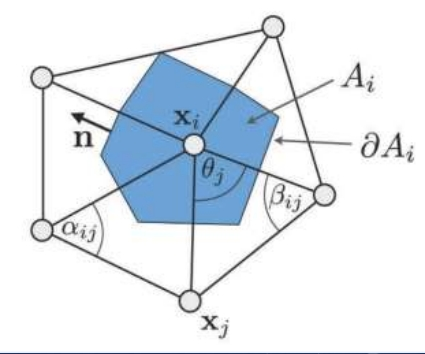
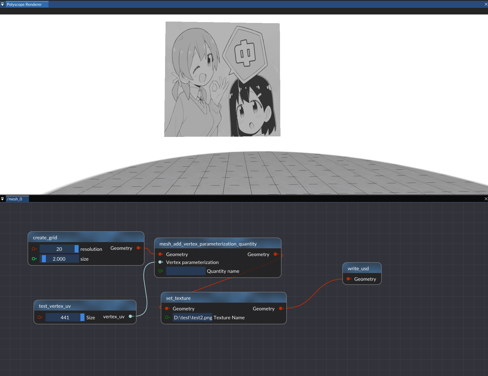
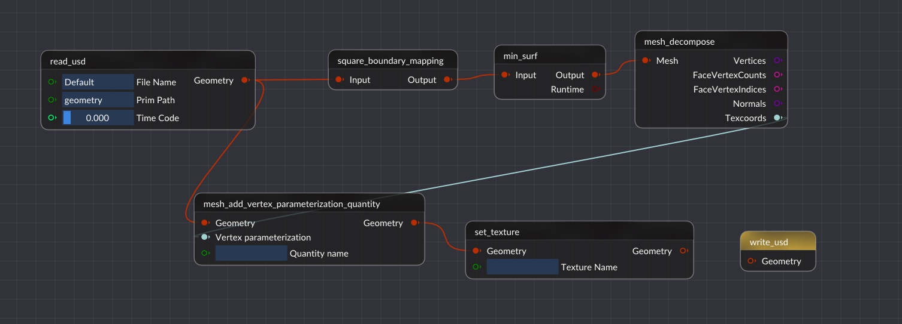

# 作业说明

## 学习过程

- 阅读 [Framework3D 框架配置说明](../../../Framework3D/README.md) 并配置框架
  - 目前没必要深入学习框架的实现，只需参考文档和[网格处理示例](./mesh_process_example.md)了解 **单个** 节点 `.cpp` 文件的编写，即可轻松完成后续作业；
- 阅读 [网格处理示例](./mesh_process_example.md) 学习网格的基本表达方式，以及我们将用到的 OpenMesh 库
  - 提供了使用作业框架和半边结构计算并可视化**三角网格曲率**的示例；
  - 学习如何通过半边结构**遍历**顶点、面、边以及访问他们的**邻域**等；
- **模仿**网格处理的示例，参考相关公式补充 [node_min_surf.cpp](../../../Framework3D/submissions/assignments/nodes/node_min_surf.cpp)，[node_boundary_mapping.cpp](../../../Framework3D/submissions/assignments/nodes/node_boundary_mapping.cpp) 等文件，连接节点图，实现简单的极小曲面和参数化效果。
  
> [!Note]
> 根据选取的权重不同，Tutte 参数化有不同的结果，**推荐**设计并封装相关的功能在 [utils/](../../../Framework3D/submissions/assignments/utils/) 文件夹下，供节点函数调用）

## 测试网格

我们提供了若干具有一条边界的**三角网格**，见 [data/](../data/) 目录，它们的表达格式是 Universal Scene Description (USD)，参考[网格数据说明](../data/README.md)。也可以访问[课程资料网盘下载](https://rec.ustc.edu.cn/share/1c0d1d10-db2e-11ef-b910-f95ea2c8844c)。

## 测试纹理

可以使用 [测试纹理](../data/test.png) 对参数化网格进行纹理贴图，检验并测试参数化的结果。

<div align=center></div align>


## 1. 固定边界求解极小曲面

完成 [极小曲面节点](../../../Framework3D/submissions/assignments/nodes/node_min_surf.cpp) ，实现网格上（均匀权重）的 **Laplace方程的建立和求解**，边界条件仍然选取为原来的空间点位置，就可以求解得到固定边界下的"**极小曲面**"。

主要步骤：
- 检测边界
- 固定边界
- 构建稀疏方程组
- 求解稀疏方程组
- 更新顶点坐标

### 参考公式
#### 顶点的微分坐标

$$ \boldsymbol\delta _ i = \boldsymbol{v _ i} - \sum _ {j \in N(i)} w _ j  \boldsymbol{v _ j},$$

其中 $N(i)$ 表示顶点 $i$ 的 1-邻域.

#### 极小曲面计算

固定边界点坐标，取均匀权重下的 $\boldsymbol{\delta} _ i = \boldsymbol{0}$ 即

$$ \frac{1}{d _ i} \sum _ {j\in N(i)} (\boldsymbol{v} _ i - \boldsymbol{v} _ j) = \boldsymbol{0}, \quad \text{for all interior } i .$$


### 参考的节点连接图（不同人写的输入输出不一定相同，这里仅供参考）（这里有关节点的简单介绍[->](../NodeIntroduction.md/)）
<div align=center></div align>

> [!tip]
> 提示
> ```cpp
> halfedge_handle.is_boundary()；
> ```
> 可以判断是否是边界，加上遍历很容易判断出哪些点是落在边界上的。
> 
> 固定边界取决于你设置的边界，你可以通过.idx()来找到点的索引，再通过点的索引来找到点的位置，进而设置点的坐标。
> 
> 这里还要说明的一点是read_usd的路径问题，以Balls举例，File Name里面填的既可以是绝对路径，也可以是相对路径，其相对路径实在Binaries/debug或release里面的，这里推荐使用相对路径。prim path可以打开Balls.usda，可以看到里面定义的路径，没有大的变动基本上就跟我输入进去的一样。

## 2. 修改边界条件得到平面参数化

### 2.1 边界映射
完成 [边界映射节点](../../../Framework3D/submissions/assignments/nodes/node_boundary_mapping.cpp)，把网格**边界映射到平面凸区域的边界**（正方形、圆形）。可以可视化检查结果的正确性。
### 2.2 参数化求解
在上述边界条件下求解同样的 Laplace 方程，可以得到（均匀权重的）**Tutte 参数化**。（连接以上两个节点！）
### 参考的节点连接图
<div align=center></div align>

## 3. 尝试比较不同的权重
计算不同权重下的 **Tutte 参数化**，例如
  - （要求实现）Cotangent weights 
  - （可选）shape-preserving weights （[Floater weights](https://www.cs.jhu.edu/~misha/Fall09/Floater97.pdf)）。

uniform 的权重可以两个节点连成，就如上图。但要注意下，conform的权重要用原网格来算，得加个 reference mesh 的输入。

### 参考公式
#### Tutte 参数化计算

分布边界点的坐标到平面凸区域的边界，求解同样的方程组：

$$ \boldsymbol{v _ i} - \sum _ {j \in N(i)} w _ j  \boldsymbol{v _ j} = \boldsymbol{0}, \quad \text{for all interior } i .$$

#### 权重选取

- Uniform weights: $w _ j = 1$;
- Cotangent weights: $w _ j = \cot \alpha _ {ij} + \cot \beta _ {ij}$（注意和原网格的几何有关）;
- Floater's shape-preserving weights (optional): 参考论文 [Floater1997](https://www.cs.jhu.edu/~misha/Fall09/Floater97.pdf)； 
- 归一化处理 :
  
$$ w _ j = \frac{w _ j}{\displaystyle \sum_k w_k }.$$


<div align=center></div align>

> [!Note]
>  - 你可以根据需求任意添加节点，或者给节点增加额外的输入、输出（不限于框架的设置）；
>  - 鼓励对实现的算法进行类的封装。

> [!Note]
> **思考：高亏格曲面？**

## 4. 纹理可视化
根据参数坐标，可以给网格贴上纹理图片，例如下面是给一个正方形网格贴上图片的例子：
<div align=center></div align>

把网格参数化到平面二维区域之后，就可以设置网格的**纹理坐标**，告诉网格如何从纹理贴图中采样颜色：（不同人写的输入输出不一定相同，这里仅供参考）
<div align=center></div align>

注意，打开纹理是在如图所示的右下角位置vertex texture color vp_(texture color)点击enable。
