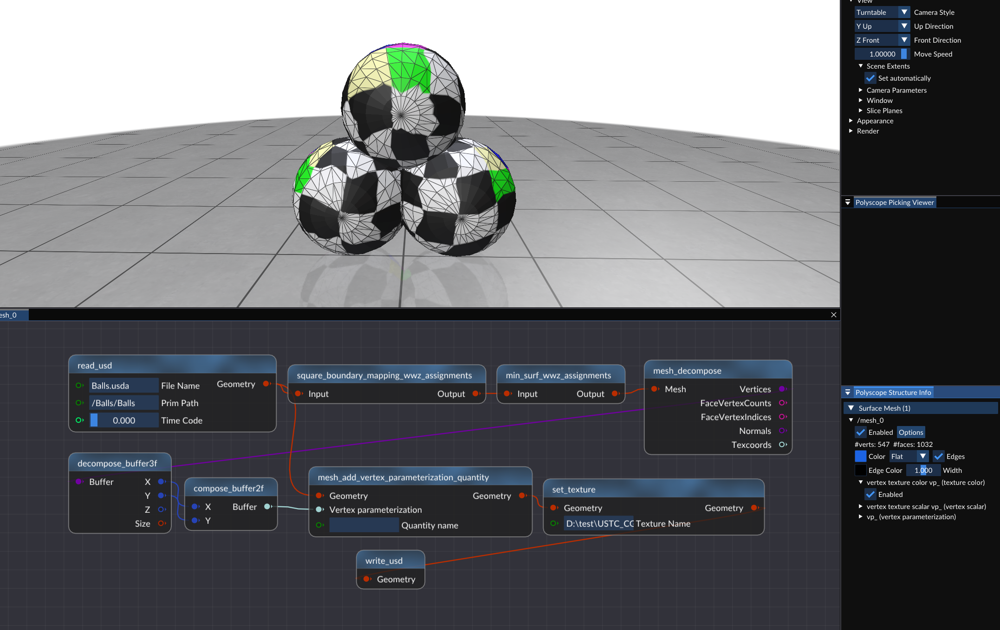

# 作业说明

## 学习过程

- 阅读 [Framework3D 框架配置说明](../../../Framework3D/README.md) 并配置框架
  - 目前没必要深入学习框架的实现，只需参考文档和[网格处理示例](./mesh_process_example.md)了解 **单个** 节点 `.cpp` 文件的编写，即可轻松完成后续作业；
- 阅读 [网格处理示例](./mesh_process_example.md) 学习网格的基本表达方式，以及我们将用到的 OpenMesh 库
  - 提供了使用作业框架和半边结构计算并可视化**三角网格曲率**的示例；
  - 学习如何通过半边结构**遍历**顶点、面、边以及访问他们的**邻域**等；
- **模仿**网格处理的示例，参考相关公式补充 [node_min_surf.cpp](../../../Framework3D/submissions/assignments/nodes/node_min_surf.cpp)，[node_boundary_mapping.cpp](../../../Framework3D/submissions/assignments/nodes/node_boundary_mapping.cpp) 等文件，连接节点图，实现简单的极小曲面和参数化效果。
  >[!Note]
  > 根据选取的权重不同，Tutte 参数化有不同的结果，**推荐**设计并封装相关的功能在 [utils/](../../../Framework3D/submissions/assignments/utils/) 文件夹下，供节点函数调用）

## 测试网格

我们提供了若干具有一条边界的**三角网格**，见 [data/](../data/) 目录，它们的表达格式是 Universal Scene Description (USD)，参考[网格数据说明](../data/README.md)。也可以访问[课程资料网盘下载](https://rec.ustc.edu.cn/share/1c0d1d10-db2e-11ef-b910-f95ea2c8844c)。

## 测试纹理

可以使用 [测试纹理](../data/test.png) 对参数化网格进行纹理贴图，检验并测试参数化的结果。

## 1. 固定边界求解极小曲面

完成极小曲面节点 [node_min_surf.cpp](../../../Framework3D/submissions/assignments/nodes/node_min_surf.cpp) ，实现网格上（均匀权重）的 **Laplace方程的建立和求解**，边界条件仍然选取为原来的空间点位置，就可以求解得到固定边界下的"**极小曲面**"。

主要步骤：
- 检测边界
- 固定边界
- 构建稀疏方程组
- 求解稀疏方程组
- 更新顶点坐标

思考：高亏格曲面？

#### Tutte 参数化计算

分布边界点的坐标到平面凸区域的边界，求解同样的方程组：

$$ \boldsymbol{v _ i} - \sum _ {j \in N(i)} w _ j  \boldsymbol{v _ j} = \boldsymbol{0}, \quad \text{for all interior } i .$$

#### 权重选取

- Uniform weights: $w _ j = 1$;
- Cotangent weights: $w _ j = \cot \alpha _ {ij} + \cot \beta _ {ij}$（注意和原网格的几何有关）;
- Floater's shape-preserving weights (optional): 参考论文 [Floater1997](https://www.cs.jhu.edu/~misha/Fall09/Floater97.pdf)； 
- 归一化处理 :
  
$$ w _ j = \frac{w _ j}{\displaystyle \sum_k w_k }.$$

> [!Note]
>  - 你可以根据需求任意添加节点，或者给节点增加额外的输入、输出（不限于框架的设置）；
>  - 鼓励对实现的算法进行类的封装。

> [!Note]
> **思考：高亏格曲面？**

## 4. 纹理可视化
根据参数坐标，可以给网格贴上纹理图片，例如下面是给一个正方形网格贴上图片的例子：

把网格参数化到平面二维区域之后，就可以设置网格的**纹理坐标**，告诉网格如何从纹理贴图中采样颜色：（不同人写的输入输出不一定相同，这里仅供参考）

