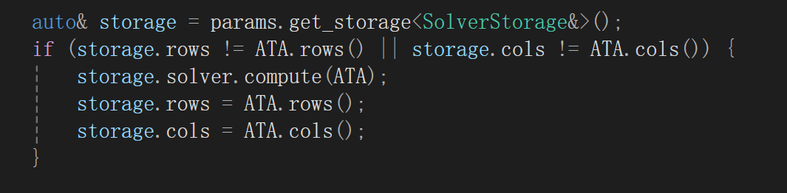

# 作业说明 

实现 SGP 2004 的 Laplace 表面编辑。

## 问题背景

### LBO的使用

拉普拉斯算子（Laplace-Beltrami Operator, LBO）作为微分几何中的关键工具，被广泛用于曲面平滑、网格变形、形状匹配等领域912。其核心目标是通过算子的本征函数（eigenfunctions）提取形状的固有特征，实现变形不变性。

## 学习过程

- 通过作业4 我们已经 [配置好了框架](../../../Framework3D/README.md)，并且学会了节点文件的编写和 [网格数据结构](../../4_tutte_parametrzation/documents/mesh_process_example.md) 的基本操作。本次作业继续沿用作业 4 的形式，你只需要在[指定目录](../../../Framework3D/submissions/)下为添加节点实现，组合现有的节点，实现[参考论文](https://graphics.stanford.edu/courses/cs468-07-winter/Papers/sgp2004_laplace.pdf)中的 Laplace 表面编辑，它对应一个未实现的[Laplace 表面编辑](../../../Framework3D/submissions/assignments/nodes/node_mesh_editing.cpp)。

- 可阅读论文和课件，按照如下思路完成本次作业：
  - **Step 1:** 导入一个现有的mesh，通过一些节点来得到所需的控制点。
  这里可以使用get_polyscope_vertices来进行点的选取，再使用get_control_points来得到你所交互的点。具体用法可以看下面。（注意这里并没有处理得到的点，只是单纯的将选中的点进行拖动，你可以将get_polyscope_vertices以及get_control_points这两个输出的结果接入你所写的节点里）
    

  - **Step 2:** 得到改变后的点，加上原网格，进行列方程求解。
    - 这里需要注意求解的要求，求解必须要达到实时这个效果，也就是说要进行预处理。预处理的具体方法放在最后。
    - 尝试不同权重的Laplace算子的选取，至少尝试均匀权重以及余切权重。
    - 点过于少的时候，可以尝试固定边界来得到比较好的结果。（注意在选做部分，由于你已经选择了区域，固定点实际上是比较多的，就不需要这个操作了）
  - **Step 3:** 更新网格点的位置，或者直接更新网格。（这里跟你的输出参数有关，为了方便，我在cpp文件中就写了更新网格点位置的输出，你可以根据自己的需要填写）
- （Optional）论文中提到的是对局部进行表面编辑，这里我们提供了一些可以进行的交互以及提供一些思路。
  - 计算测地线，node_get_vertices_by_left_click.cpp节点可以通过左键点击点来得到你所有左键点过的点的indices，再通过node_shortest_path.cpp中写的最短路径算法来计算测地线的点的indices（这里可能需要你自己去借鉴一下里面写的内容）
  - 获得你所选中的区域，node_get_polyscope_vertices.cpp允许你中键选择一些点，并且可以移动他们（作为控制点）。结合你写的测地线，可以通过一些搜索算法，比如最广优先搜索算法，搜索至边界后停止，将你搜索到的点的indices输出。
  - 建立稀疏矩阵，在得到上述区域之后，再进行稀疏方程的求解，方法与上述类似，通过这些操作，你最终可以在局部进行编辑的操作。

- **Note**: 
  - 你可以根据需求任意添加节点，或者给节点增加额外的输入、输出；
  - 鼓励对实现的算法进行类的封装。

## 测试网格

补充提供了若干具有一条边界的**三角网格**，见 [data/](../data/) 目录，它们的表达格式是 Universal Scene Description (USD)，参考[网格数据说明](../../4_tutte_parametrzation/data/README.md)。也可以访问[课程资料网盘下载](https://rec.ustc.edu.cn/share/1c0d1d10-db2e-11ef-b910-f95ea2c8844c)。

## 一些交互节点的介绍以及存储功能的介绍

### 存储功能的介绍

目前节点的逻辑是，每当下面节点系统改变时，整个节点系统都会跑一遍，那么就需要用一些特殊的方式来进行存储，使得某些数据不会跟着一直在跑，这里使用如下图的方式进行存储数据。

首先，先定义一个要存储的类型，这里就以SolverStorage为例，定义完类型之后可以在程序里面如此使用：

如此即可将内部的数据存储起来。

### 点的交互功能

必做作业中的点的交互有如下的两个节点

get_polyscope_vertices当你建立这个节点的时候，你就可以使用中间点击一个点来得到一个活动标架，当然你也可以不停的中间点击多个活动标架，你可以移动活动标架来移动这个点。其输出的是所有点现在的位置（包括没有移动的点）。get_control_points是得到你所中键点的indices。得到标架后就如下图所示，你可以调节polyscope info来进行对标架大小的变化。

这里需要注意的一个点是Structure Name里面填的东西是你当前网格的名称，比如你新建了一个mesh，这个mesh的名称就叫mesh_0，则内部就填/mesh_0，你可以看stage veiwer里面叫什么，也可以看你edit的界面的左上角的名字。

至于Optional部分，点选测地线的时候，为了不与控制点所混淆，这里可以使用get_vertices_by_left_click这个节点，这个节点与上述节点类似，当你左键点的时候可以将这个点添加到一个list内部，然后输出你所选择的点的indices。

一个简单的效果图：（必做部分）

